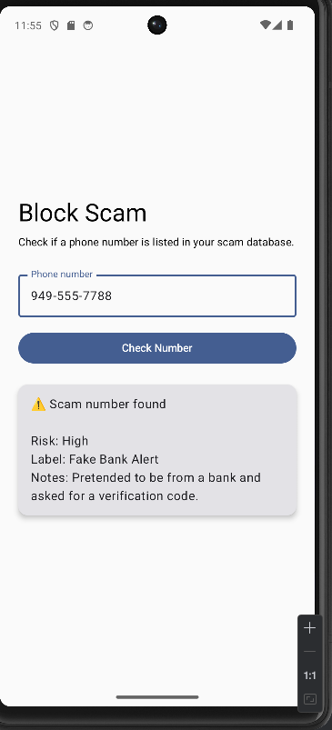
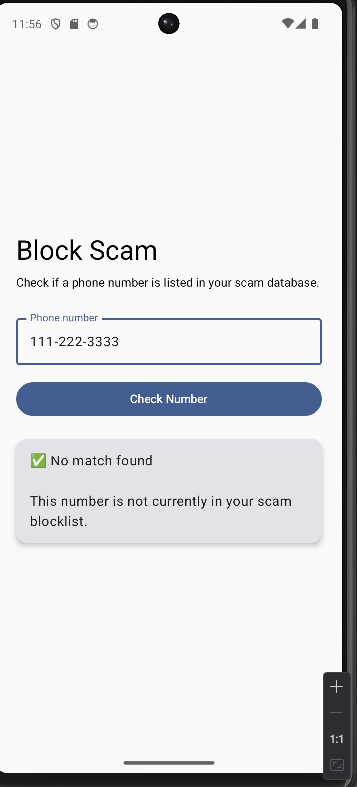

# blockscam-android

Kotlin Android client for the Block Scam backend API.

## Backend API

This Android app connects to the Block Scam backend API.

Backend repository: https://github.com/Acos2ver/blocked-numbers

During local emulator testing, the app uses:

```txt
http://10.0.2.2:3000
```

## Current Feature

- Check whether a phone number exists in the Block Scam database
- Display scam risk level, label, and notes when a number is found
- Display a safe message when no match is found

## Test Numbers

### Scam number found

```txt
949-555-7788
```



### No match found

```txt
111-222-3333
```



## Local Testing Notes

Before running the Android app, start the backend server:

```bash
cd ~/scam-blocker
npm start
```

The backend should be running on:

```txt
http://localhost:3000
```

The Android emulator accesses the local backend through:

```txt
http://10.0.2.2:3000
```
